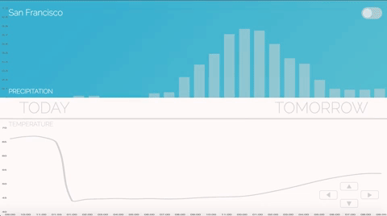

# Neue Weather 

[Neue Weather Live](https://neue-weather.herokuapp.com/)

## Overview

Weather in California may be boring, but your weather app doesn't have to be. **Neue Weather** is a beautiful weather application that elevates the user experience to art. 

This application is inspired by mobile apps such as Dark Sky and Weathertron, and aims to bring a very clean and modern interface to the desktop experience--utilizing the latest best practices in Vanilla Javascript(ES6), CSS3, and HTML5.



## Technologies
`Vanilla JS` for logic

`Node.js and Express` server-side API calls for weather data

`Chart.js` charts for temp curve line and bar graphs

`Dark Sky` weather `API` for JSON data

`Pusher` to build scalable, real time functionality to features

`HTML5` an `CSS3` (flexbox for responsiveness)

## A look at Code
Neue Weather allows the user to toggle from day to night mode, with an extra surprise. Night mode fills the sky with a galaxy of stars. Here I created 100 new divs and scattered them across the height and width of their parent div at different top and left positions

app.js
```js
    const generateStars = () => {
        let galaxy = document.getElementById("precip");
        let i = 0;

        while (i <= 100) {
            let star = document.createElement("div");
            star.id = "star";
            let xPosition = Math.random();
            let yPosition = Math.random();
            let starType = Math.floor(Math.random() * 3 + 1);
            let position = {
                x: galaxy.clientWidth * xPosition,
                y: galaxy.clientHeight * yPosition
            };
            star.className = `star star-type${starType}`;
            star.style.top = `${Math.floor(position.y)}px`;
            star.style.left = `${Math.floor(position.x)}px`;
            galaxy.appendChild(star);
            i++;
        }
    };
```
Pusher is popular for direct messaging apps. I decided that their technology would add some great feature functionality to the app by allowing for real-time weather updates. The code below subscribes pusher to an **axios async await** function and pushes the incoming data to **chart.js** datapoints

app.js
```js
    channel = pusher.subscribe("local-weather-chart");
    channel.bind("new-weather", data => {
        let newWeatherData = data.dataPoint;
        if (weatherChartRef.data.labels.length > 15) {
            weatherChartRef.data.labels.shift();
            window.precipChartRef.data.labels.shift();
            weatherChartRef.data.datasets[0].data.shift();
            window.precipChartRef.data.datasets[0].data.shift();
        }
        weatherChartRef.data.labels.push(newWeatherData.time);
        window.precipChartRef.data.labels.push(newWeatherData.time);
        weatherChartRef.data.datasets[0].data.push(newWeatherData.temp);
        window.precipChartRef.data.datasets[0].data.push(newWeatherData.precip);

        weatherChartRef.update();
        window.precipChartRef.update();
    });
```
## Functionality

* Users can visualize weather data representations of temperature(in F° or C°), cloud cover, and a 5-day forecast
* Application includes todays weather conditions. Users can interact with the page by mousing over the screen to view data at different times through the day
* KeyLeft to view the 7-day forecast and instructional slides
* KeyRight to view toggles to change temperature from C° to F°
* KeyDown to reveal the current time, cloud cover and icon
* KeyUp to view search by city
* Background colors will also shift from blues/light to dark theme experience
* Forecast, and current temperature will update in real-time without the need for browser refresh

## Future Updates and bugs fixes

- [ ] previous graphs arent destroying properly after a new graph is loaded causing flickering
- [ ] Pusher is in conflict with data for the 5 day forecast causing error
- [ ] Code needs refactoring and to be broken down into separate modules, organized by feature
- [ ] Data for the 5 day forecast needs to be shaped better in server.js so it's rendering function can be simpler
- [ ] Screen looks good down to about 650px in width. I will implement a slightly different experience for smartphone experience
