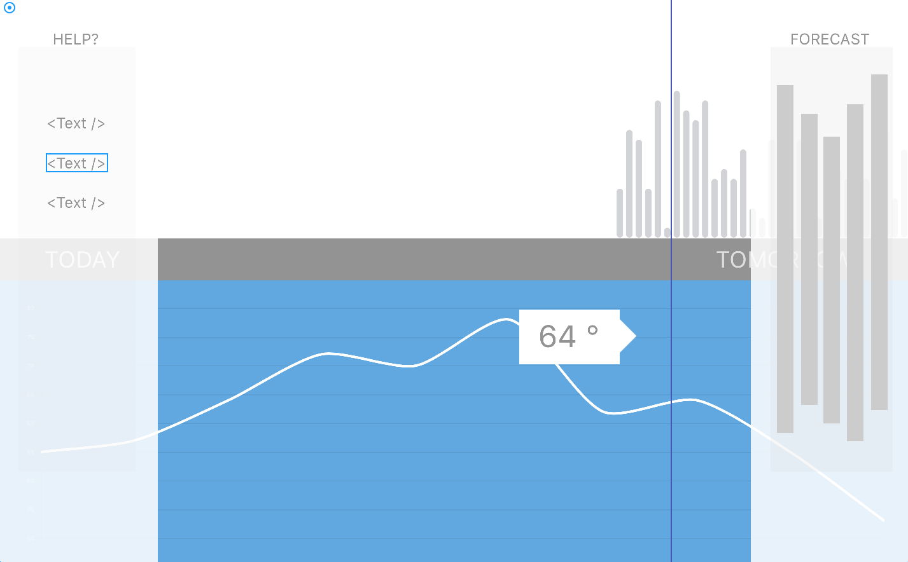

# Neue Weather 

[Neue Weather Live](https://neueweather.com/)

## Overview

Weather in California may be boring, but your weather app doesn't have to be. **Neue Weather** is a beautiful weather application that elevates the user experience to art. 

This application is inspired by mobile apps such as Dark Sky and Weathertron, and aims to bring a very clean and modern interface to the desktop experience--utilizing the latest best practices in Vanilla Javascript(ES6), CSS3, and HTML5.

## Functionality

* Users can visualize weather data representations of temperature(in F° or C°), cloud cover, and a 7-day forecast
* Landing page includes todays weather conditions. Users can interact with the page by mousing over the screen to view data at different times through the day
* KeyLeft/KeyRight to view the 7-day forecast and instructional slides
* KeyDown to reveal the current time, humidity, dewpoint
* Background colors will also shift from blues/light to dark theme as the user navigates from day to night forecasts
* Forecast, and current temperature will update in real-time without the need for browser refresh

## Wireframes

## Technologies
`Vanilla JS` for logic

`Node.js` server API's for monitoring and analytics

`Chart.js` charts for temp curve line and bar graphs

`Dark Sky` weather `API` for JSON data

`Pusher` to build scalable, real time features

`HTML5` an `CSS3` (flexbox for responsiveness)

## MVP's 

- [ ] Adequate and Responsive Styling
- [ ] Graphing that updates in real time
- [ ] Data visualization updates with user interaction
- [ ] Smooth, bug-free user experience

## Implementation Timeline

### Day 1
* Research technologies and build knowledge for implementation
* Complete README with wireframes

### Day 2
* Build out skeleton and basic functionality of app
* Begin implementing API's for Pusher, Chart.js and Dark Sky

### Day 3
* Complete API's for Pusher, Chart.js and Dark Sky data
* Basic realtime functionality progress utilizing OOP best design practices

### Day 4 
* Continued realtime data functionality and layout in browser utilizing OOP best design practices

### Day 5
* CSS3 Responsive styling for all screen sizes

### Day 6 
* Custom URL and hosting provider
* Site is LIVE
